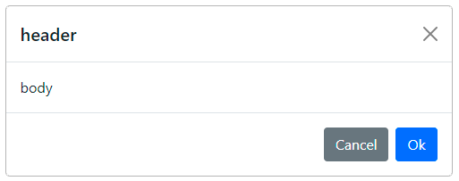
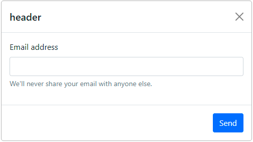
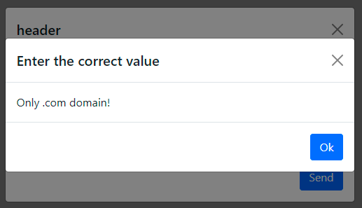

# Simple dialogs based on Bootstrap 5 modal

Lightweight pure js dialogs library, min ad gz size less 2 kB

> Dependencies
>* bootstrap 5

[demo](https://jsfiddle.net/Alexander_Titov/z8dfpLyw/8)

## Dialogs

### ok_cancel

```js
let ret = await new BsDialogs().ok_cancel('header', 'body')

// ret = 'ok' || 'cancel' || undefined - if press close button
```



#### Options
`new BsDialogs(options)`

```js
// default values
let options = {
    centered: true,
    backdrop: 'static',
    close: true,  // show close button
    size: '',
    fullscreen: null,
    scrollable: false
}
```
> size: `'' || 'sm' || 'lg' || 'xl'`  
> [more details](https://getbootstrap.com/docs/5.0/components/modal/#optional-sizes)

> fullscreen: `null || '' || 'sm-down' || 'md-down' || 'lg-down' || 'xl-down' || 'xxl-down'`  
> [more details](https://getbootstrap.com/docs/5.0/components/modal/#fullscreen-modal)

### yes_no
```js
let ret = await new BsDialogs().yes_no('header', 'body')

// ret = 'yes' || 'no' || undefined - if press close button
```

### ok
```js
let ret = await new BsDialogs().ok('header', 'body')

// ret = 'ok' || undefined - if press close button
```

### custom
```js
let ret = await new BsDialogs().custom(
    'header', 'body',
    [['Abort', 'btn-secondary', 'abort'], ['Yes', 'btn-primary', 'yes']]
)
// ['Abort', 'btn-secondary', 'abort']
//  title      btn class     ret value

// ret = 'abort' || 'yes' || undefined - if press close button
```
> btn class: [more details](https://getbootstrap.com/docs/5.0/components/buttons/)


## Form

```js
let frm = `<form>
  <div class="mb-3">
    <label for="exampleInputEmail1" class="form-label">Email address</label>
    <input type="email" data-name="email" class="form-control" id="exampleInputEmail1" aria-describedby="emailHelp" required>
    <div id="emailHelp" class="form-text">We'll never share your email with anyone else.</div>
  </div>
</form>`
// !!! do not forget to put in the fields data-name="..."

let dlg = new BsDialogs()
dlg.form('header', 'Send', frm)
let ret = await dlg.onsubmit()
console.log(ret)  // {email: test@test.com}
```



If you want to further validate the values before submitting the form data, you should do the following:

```js
let frm = `<form>
  <div class="mb-3">
    <label for="exampleInputEmail1" class="form-label">Email address</label>
    <input type="email" data-name="email" class="form-control" id="exampleInputEmail1" aria-describedby="emailHelp" required>
    <div id="emailHelp" class="form-text">We'll never share your email with anyone else.</div>
  </div>
</form>`
// !!! do not forget to put in the fields data-name="..."

let dlg = new BsDialogs()
dlg.form('header', 'Send', frm)

while (true) {
    let ret = await dlg.onsubmit(true)
    if (ret === undefined) { // if close
        break
    }
    if (ret['email'].slice(-4) === '.com') {
        // we carry out the necessary actions
        break
    } else {
        await new BsDialogs().ok('Enter the correct value', 'Only .com domain!')
    }
}
dlg.close()
```


